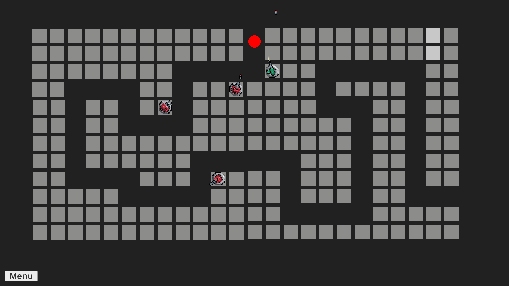
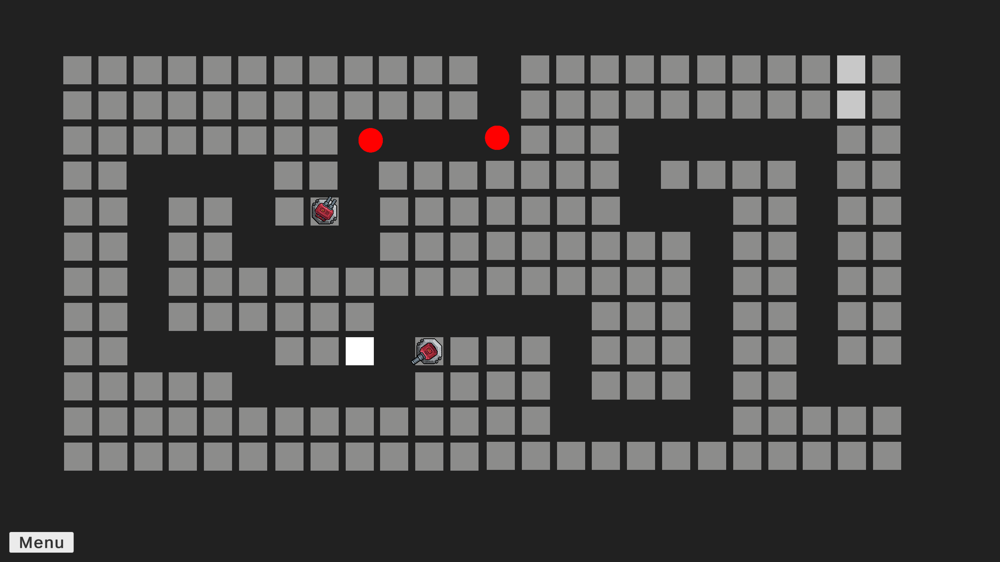
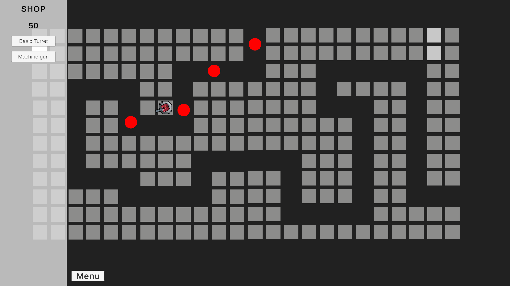

# Tower Defense

A 2D Tower Defense game developed in Unity using C#.

## Features
- Multiple enemy waves
- Different tower types
- Tower upgrade system
- Enemy pathfinding
- Currency system

## Technologies
- Unity
- C#
- Visual Studio

## Screenshots

## Controls
- Left Mouse Button – Place and upgrade towers
- ESC – Pause game

## How to Run
Open the project in Unity Hub and use the Unity version specified in ProjectSettings.